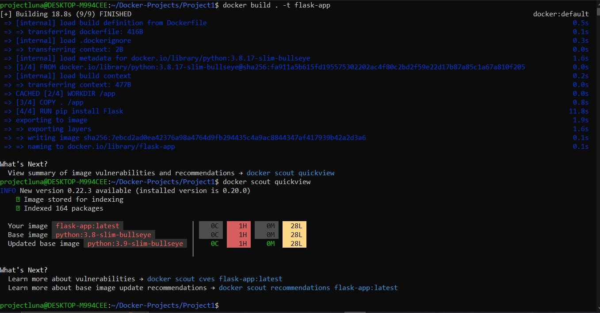
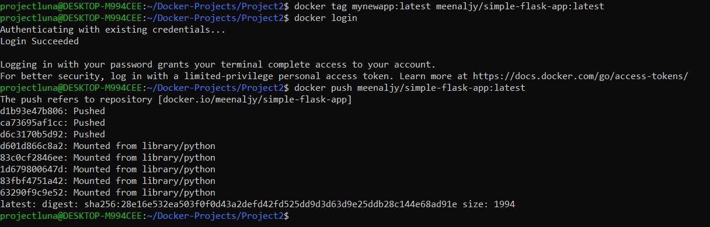
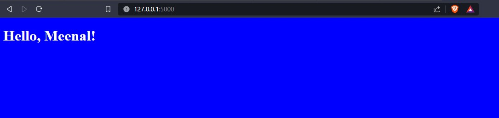
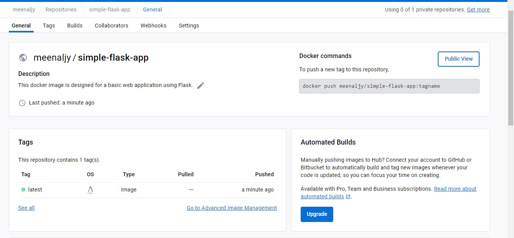

### DevOps Flask App

Welcome to the DevOps Flask App repository! 🚀

This repository showcases a simple Flask web application that has been containerized using Docker. Whether you're new to DevOps or looking to enhance your containerization skills, this project is a great starting point.

## Table of Contents

- [About the Project](#about-the-project)
- [Getting Started](#getting-started)
- [Usage](#usage)
- [Contributing](#contributing)


## About the Project

The DevOps Flask App is designed to demystify the process of containerizing a Python web application using Docker. It serves as a hands-on example of how to create a Docker image, set up a development environment, and deploy a containerized app.

Key features of this project:
- Simple Flask web app demonstrating basic functionality.
- Dockerfile included for containerization.
- Educational resource for learning about Docker and DevOps practices.

## Getting Started

To get started with the DevOps Flask App, follow these steps:

1. **Clone the Repository**: Begin by cloning this repository to your local machine using the following command:

   ```
   git clone https://github.com/your-username/devops-flask-app.git
   ```

2. **Navigate to the Project Directory**: Change your working directory to the project folder:

   ```
   cd devops-flask-app
   ```

3. **Build the Docker Image**: Use Docker to build the image for the Flask app:

   ```
   docker build -t devops-flask-app .
   ```





4. **Run the Container**: Start a container based on the newly created image:

   ```
   docker run -p 5000:5000 devops-flask-app
   ```


   
  


6. **Access the App**: Open your web browser and navigate to [http://localhost:5000](http://localhost:5000) to see the running Flask app.


    

   
    


   
## Usage

This project serves as both a learning resource and a starting point for further exploration. Feel free to modify the Flask app, experiment with different Docker configurations, or integrate additional tools and services to enhance your DevOps skills.

## Contributing

Contributions are welcome! If you've discovered improvements or fixes, please submit a pull request. For major changes or new features, it's a good idea to open an issue first to discuss your ideas.


By exploring the DevOps Flask App repository, you'll gain insights into containerization, Docker, and DevOps principles. Happy coding and containerizing! If you have any questions or need further assistance, don't hesitate to reach out.

**Keep learning, keep building!** 🛠️📚


